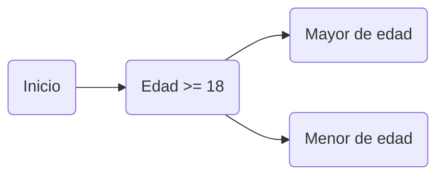
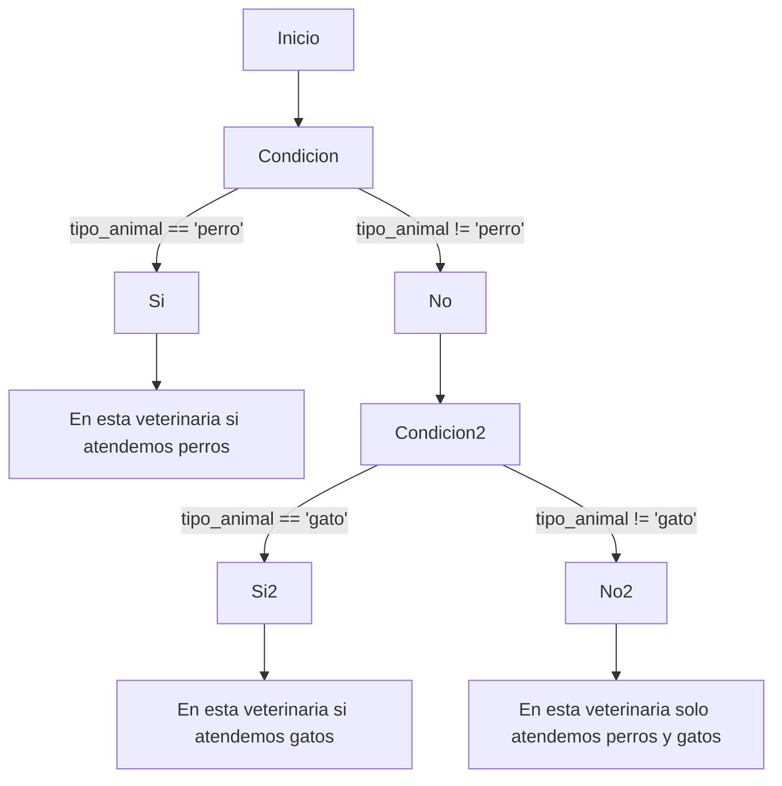
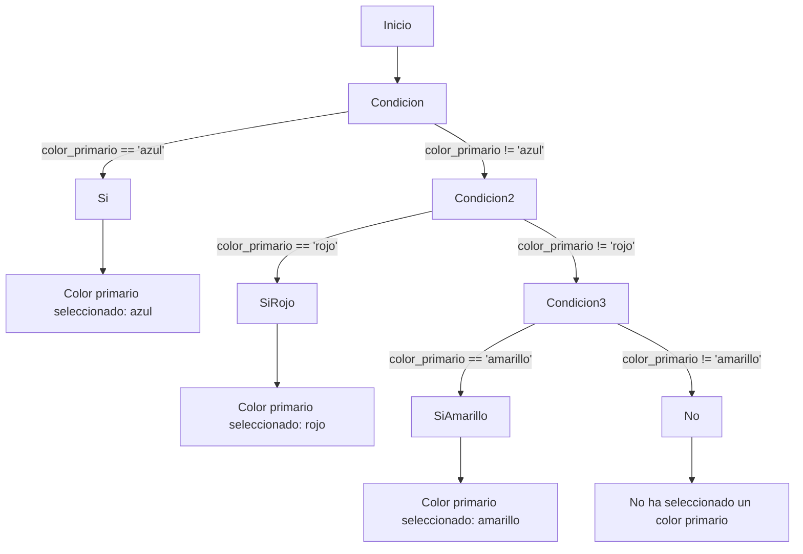
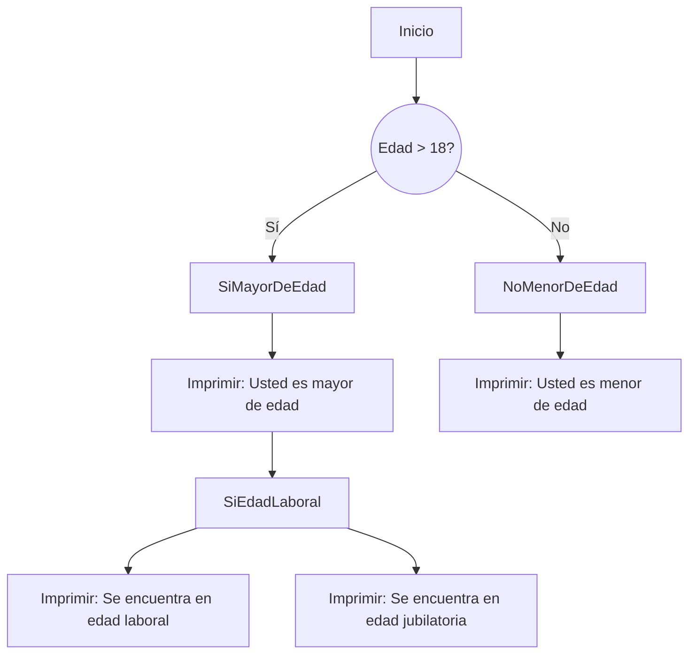
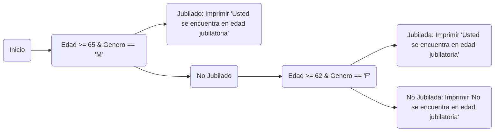

# INTRO A PYTHON 2
Aqui tenemos algunos gráficos de los diferentes ejercicios para orientarlos

## IF ELSE
Veamos como se ve utilizar if else elif

### Ejercicio 1.2

### Ejercicio 1.7

### Ejercicio 1.8

### Ejercicio 1.9

### Ejercicio 1.10

